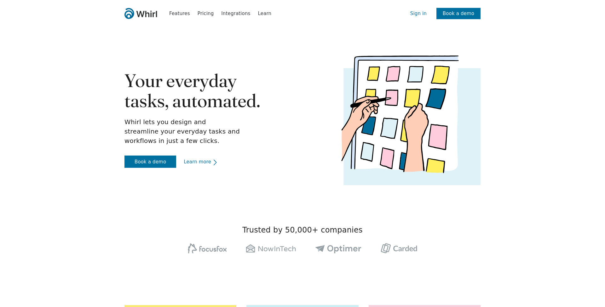

# Whirl — лендинг


Адаптивный лендин, который выполнен по методологии **БЭМ**, с использованием **SCSS** и нативного **JavaScript** для динамического поведения.

👉 [Посмотреть онлайн (GitHub Pages)](https://zheny179.github.io/Whirl/)

---

## 📸 Скриншот



---

## 🛠️ Технологии
- **HTML5** — семантическая вёрстка
- **SCSS** — модульная структура стилей
- **БЭМ** — методология именования и организации блоков
- **JavaScript (ES6)** — аккордеон.
- **Адаптивность** — поддержка всех устройств

---

## 🌟 Особенности
- Создания аккордеона на JS
- Чистый и понятный код
- Лёгкость в кастомизации и расширении

---

## 🚀 Как запустить локально
1.  Склонируй репозиторий:
    ```bash
    git clone https://github.com/Zheny179/Whirl.git
    ```
3.  Перейти в папку Whirl
4.  Открыть файл *index.html* в браузере
